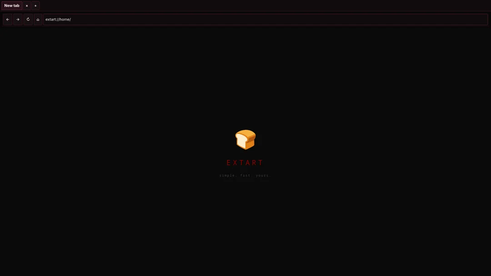

# EXTART 🍞

<p align="center">
  
</p>

A minimal web browser for Linux focused on simplicity, efficiency, stability, and low resource usage.

## Engine migration: Gecko

EXTART is being migrated from **WebKitGTK 6.0 to Gecko**, while keeping the browser's **GTK4 native UI**.

The goal is to use Gecko's web platform — HTML/CSS, JavaScript, networking, DOM, graphics, security, and multi-process architecture — without carrying Firefox's desktop browser UI and services into EXTART. Gecko itself provides the core web engine and process infrastructure used by Firefox. citeturn1view0

The migration is intentionally being done in stages. Mozilla's current Linux documentation describes building Gecko through the Firefox source tree with `./mach build`; a full Gecko build needs substantial disk space and recommends 8 GB or more of RAM. citeturn1view1

### Current migration state

- GTK4 UI remains the EXTART application layer.
- A dedicated `GeckoBackend` integration boundary has been added.
- EXTART can locate a configured Gecko/Firefox runtime through `EXTART_GECKO_RUNTIME` or the normal Linux `PATH`.
- The old WebKitGTK backend is still present temporarily so the repository remains buildable while the native Gecko embedding layer is developed.
- **The browser content is not yet claimed to be Gecko-rendered.** The next stage is the actual native Gecko embedding/process integration.

This separation is deliberate: Mozilla's current source documentation describes Gecko's browser-process architecture and its internal embedding/navigation pieces, but there is no current drop-in GTK4 `WebKitWebView`-style Gecko widget for Linux. citeturn1view0turn6search0

## Architecture target

```text
EXTART
├── GTK4 UI
│   ├── windows
│   ├── tabs
│   ├── URL/search bar
│   ├── bookmarks
│   ├── history
│   ├── downloads
│   └── settings
│
└── Gecko
    ├── HTML / CSS
    ├── SpiderMonkey
    ├── DOM / Web APIs
    ├── Necko networking
    ├── graphics / WebRender
    ├── security / sandbox
    └── multi-process IPC
```

## Existing browser features

- Multiple tabs and windows
- Back / Forward / Reload
- Address and search bar
- Persistent browser profile
- Cookies and web data
- Basic configuration storage
- Linux XDG directory support
- GTK4 interface
- Embedded resources using GResource
- History tracking
- Download management
- Bookmarks
- Page search (Ctrl+F)
- Keyboard shortcuts

## Build

### Requirements

- Linux
- C++17 compiler
- CMake
- GTK4
- WebKitGTK 6.0 (temporary migration dependency)
- Gecko source/build environment for the native engine integration

### Compile

```bash
git clone https://github.com/pitertapia884-commits/extart.git
cd extart

cmake -S . -B build
cmake --build build
```

For Gecko development itself, Mozilla documents the `./mach build` workflow in the Firefox source tree. citeturn1view1

## Project philosophy

> Use only what is necessary for browsing, and remove everything that does not directly contribute to it.

The main priorities are:

- **Simplicity** - Minimal UI, straightforward navigation
- **Efficiency** - Low RAM and CPU usage
- **Stability** - Reliable and predictable behavior
- **Speed** - Fast startup and page loading

EXTART is not intended to compete with large browsers by adding more features. Every feature must justify its existence.

## Configuration

Settings are stored in `~/.config/extart/settings.ini`.

## Data storage

EXTART respects XDG directory standards:

- **Config:** `~/.config/extart/`
- **Data:** `~/.local/share/extart/`
- **Cache:** `~/.cache/extart/`

## Gecko integration

The runtime can be explicitly selected with:

```bash
EXTART_GECKO_RUNTIME=/path/to/gecko-runtime ./build/extart
```

If that variable is not set, EXTART searches `PATH` for `firefox` and `firefox-nightly`.

This runtime discovery is only the first integration layer. It does not pretend that launching Firefox is equivalent to embedding Gecko; the native content-view embedding remains the next engineering step.

## License

License not decided yet.

---

The logo is a toaster 🍞 — simple, reliable, does one thing well.
